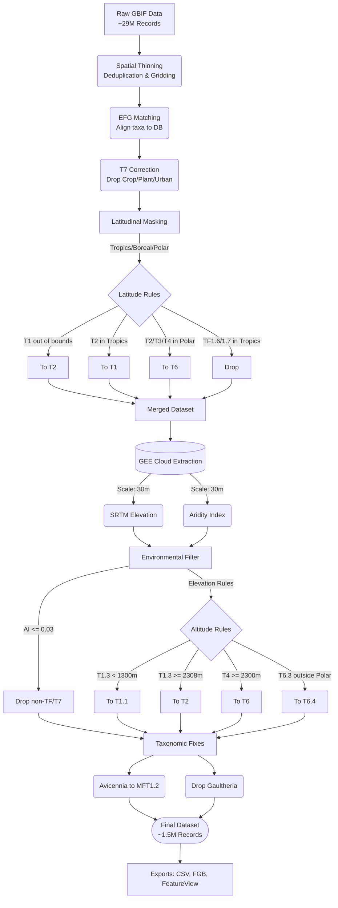

# GBIF Global Ecosystem Indicator Species Pipeline

This repository houses the automated data processing pipeline for filtering, classifying, and mapping global ecosystem indicator species for the EcoViewer. The workflow systematically processes raw biodiversity occurrence data and aligns it with the IUCN Global Ecosystem Typology through a series of spatial, environmental, and latitudinal constraints.

##  Pipeline Overview

The core objective of this pipeline is to reduce a raw GBIF dataset of global plant occourances for the last 10 years down to a highly accurate subset of indicator species that obey defined physical and ecological boundaries. 

The pipeline handles:
1. Spatial thinning of dense occurrence records.
2. Ecosystem Functional Group (EFG) and Biome matching.
3. Masking of anthropogenic environments. (Urban and Industrial Ecosystems, Plantations and Croplands)
4. Latitudinal boundary enforcement. (Tropical/Subtropical, Temperate and Polar)
5. High-resolution environmental filtering using SRTM Elevation & Aridity Index.

## 📊 Data Reduction Flowchart

## 📁 Repository Structure

* `src/` - Contains all executable Python and sql processing scripts.
  * `urban_mask_merge.py` - Ingests and merges spatial mask chunks.
  * `latitudinal_mask.py` - Applies physical boundary constraints to EFGs.
  * `elevation_aridity_mask.py` - Enforces altitude and dryland survival rules.
* `data/` - (GitIgnored) Local storage for raw and processed outputs.
  * `mapping/` - Contains configuration files like `latitudinal_bounds.txt`.
  * `outputs/` - Contains intermediate CSVs and final FlatGeobuf files.

## 🚀 Execution Steps

To reproduce this pipeline from the raw datasets:

**Step 1: Local Masking & Latitudes**
1. Ensure the split mask CSVs are located in `data/outputs/urban_mask/`.
2. Run `python src/urban_mask_merge.py` to compile the baseline dataset.
3. Run `python src/latitudinal_mask.py` to enforce the physical biome boundaries.

**Step 2: Cloud Environmental Extraction**
1. Upload `Global_Final_Latitudinal.csv` to Google Cloud Storage / Earth Engine Assets.
2. Execute the GEE extraction script to sample SRTM Elevation and Aridity Index.
3. Export the resulting CSV back to your local environment.

**Step 3: Final Environmental Filtering**
1. Place the GEE-enriched CSV into `data/outputs/`.
2. Run `python src/elevation_aridity_mask.py`.
3. The final, publication-ready dataset will be generated in both `.csv` and `.fgb` formats.
